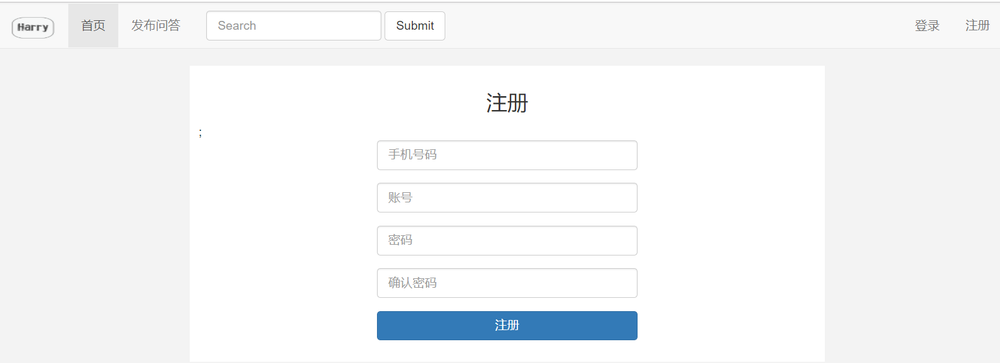

# Fourth-app.py中方法及对应的html/css

## 首先**我们需要导入flask包中的一些类，配置文件config，数据库模型和sqlalchemy操作db以及装饰器中的装饰器，接着将app+db初始化**

```text
from flask import Flask,render_template,request,redirect,url_for,session,g
import config
from models import User, Question, Answer
from exts import db
from decorators import login_required
from sqlalchemy import or_ 

app = Flask(__name__)
app.config.from_object(config)
db.init_app(app)

if __name__ == '__main__':
    app.run(debug=True)
```

#### html父模板样式：

需要导入`bootstrap`，并通过`bootstarp`中一些特定类，更改样式,并在代码中设置`block`以供子模版继承后自定义样式


```text
base.html:

<!DOCTYPE html>
<html lang="en">
<head>
    <meta charset="UTF-8">
    <title>-Meows</title>
        <link rel="stylesheet" href="https://cdn.jsdelivr.net/npm/bootstrap@3.3.7/dist/css/bootstrap.min.css" integrity="sha384-BVYiiSIFeK1dGmJRAkycuHAHRg32OmUcww7on3RYdg4Va+PmSTsz/K68vbdEjh4u" crossorigin="anonymous">
    <script src="https://cdn.bootcss.com/jquery/3.3.1/jquery.min.js"></script>
    <script src="https://cdn.jsdelivr.net/npm/bootstrap@3.3.7/dist/js/bootstrap.min.js" integrity="sha384-Tc5IQib027qvyjSMfHjOMaLkfuWVxZxUPnCJA7l2mCWNIpG9mGCD8wGNIcPD7Txa" crossorigin="anonymous"></script>
    <link rel="stylesheet" href="{{ url_for('static',filename='css/base.css') }}">
     
</head>
<body>
    <nav class="navbar navbar-default">
  <div class="container">
    <!-- Brand and toggle get grouped for better mobile display -->
    <div class="navbar-header">
      <button type="button" class="navbar-toggle collapsed" data-toggle="collapse" data-target="#bs-example-navbar-collapse-1" aria-expanded="false">
        <span class="sr-only">Toggle navigation</span>
        <span class="icon-bar"></span>
        <span class="icon-bar"></span>
        <span class="icon-bar"></span>
      </button>
      <a class="navbar-brand" href="#">
          
      </a>
    </div>

    <!-- Collect the nav links, forms, and other content for toggling -->
    <div class="collapse navbar-collapse" id="bs-example-navbar-collapse-1">
      <ul class="nav navbar-nav">
        <li class="active">
            <a href="{{ url_for('index') }}">首页 <span class="sr-only">(current)</span></a>
        </li>
        <li>
            <a href="{{  url_for('question')}}">发布问答</a>
        </li>
{#        <li class="dropdown">#}
{#          <a href="#" class="dropdown-toggle" data-toggle="dropdown" role="button" aria-haspopup="true" aria-expanded="false">Dropdown <span class="caret"></span></a>#}
{#          <ul class="dropdown-menu">#}
{#            <li><a href="#">Action</a></li>#}
{#            <li><a href="#">Another action</a></li>#}
{#            <li><a href="#">Something else here</a></li>#}
{#            <li role="separator" class="divider"></li>#}
{#            <li><a href="#">Separated link</a></li>#}
{#            <li role="separator" class="divider"></li>#}
{#            <li><a href="#">One more separated link</a></li>#}
{#          </ul>#}
{#        </li>#}
      </ul>
      <form class="navbar-form navbar-left" action="{{ url_for('search')}}"method="get">
        <div class="form-group">
          <input name="q" type="text" class="form-control" placeholder="Search">
        </div>
        <button type="submit" class="btn btn-default">Submit</button>
      </form>
      <ul class="nav navbar-nav navbar-right">
        
            <li><a href="#">{{ user.username }}</a></li>
            <li><a href="{{ url_for('logout') }}">注销</a></li>
         
            <li><a href="{{ url_for('login')  }}">登录</a></li>
            <li><a href="{{ url_for('regist') }}">注册</a></li>
          
{#        <li class="dropdown">#}
{#          <a href="#" class="dropdown-toggle" data-toggle="dropdown" role="button" aria-haspopup="true" aria-expanded="false">Dropdown <span class="caret"></span></a>#}
{#          <ul class="dropdown-menu">#}
{#            <li><a href="#">Action</a></li>#}
{#            <li><a href="#">Another action</a></li>#}
{#            <li><a href="#">Something else here</a></li>#}
{#            <li role="separator" class="divider"></li>#}
{#            <li><a href="#">Separated link</a></li>#}
{#          </ul>#}
{#        </li>#}
      </ul>
    </div><!-- /.navbar-collapse -->
  </div><!-- /.container-fluid -->
</nav>
    <div class="main">
         
    </div>

</body>
</html>
```

```text
base.css:

.logo{
    width: 50px;
    height: 25px;
    overflow: hidden;
}
body{
    background: #f3f3f3;
}
.main{
    background: #ffffff;
    width:730px;
    margin: 0 auto;
    overflow: hidden;
    padding: 10px;
}
.page-title{
    text-align: center;
}
```

#### 主页方法：

```text
@app.route('/')
def index():
    context = {
        'questions': Question.query.order_by("create_time").all()
    }
    return render_template('index.html', **context)
    
# 首页需要展示问答内容，所以需要在数据库中查找问答，并以时间顺序导出传到index.html中
```

继承base.html，在`block main`中for循环遍历`questions`，将其全部展示

```text
index.html:



首页

    <link rel="stylesheet" href="{{ url_for('static',filename='css/index.css') }}">



    <ul class="question-list-group">
    
         <li>
           <div class="avatar-group">
                
            </div>
            <div class="question-group">
                <p class="question-title"><a href="{{ url_for('detail',question_id=question.id) }}">{{ question.title }}</a></p>
                <p class="question-content">{{ question.content }}</p>
                <div class="question-info">
                    <span class="question-author">{{ question.author.username }}</span>
                    <span class="question-time">{{ question.create_time }}</span>
                </div>
            </div>
        </li>
    

    </ul>

```

```text
index.css:

ul{
    list-style: none;
    padding-left: 0;
}
ul.question-list-group li{
    border-bottom: 1px solid #eee;
    overflow: hidden;
    padding: 15px 0;
}
.avatar-group{
    width: 30px;
    height: 100%;
    float: left;
}
.avatar-group .avatar{
    width: 38px;
    height: 38px;
}
.question-group{
    float: left;
    width: 660px;
    margin-left: 10px;
}
.question-title a{
    color:#259;
    font-weight: 900;
}
.question-info{
    text-align: right;
}
.question-info .question-author{
    margin-right: 20px;
}
```

#### 注册方法：



     注册方法中需要用到`get`和`post`两种方法，需要在装饰器中，`get`方法就转入到注册页面。`post`方法时，分别从用户表单中获得`telephone`,`username`,`password`,`confirm_password`这些数据，然后数据库中查看telephone是否已经存在，如果不存在则判断`password`和`confirm_password`是否一致，一致时则创建user并通过`db.session`提交新建到数据库，表示注册完成，再重新跳转到登陆页面

```text
@app.route('/regist/',methods=['GET','POST'])
def regist():
    if request.method =='GET':
        return render_template('regist.html')
    else:
        telephone = request.form.get('telephone')
        username = request.form.get('username')
        password = request.form.get('password')
        confirm_password = request.form.get('confirm-password')

        # 手机号码验证如果被注册了就不能注册
        user = User.query.filter(User.telephone == telephone).first()
        if user:
            return '该号码已经注册'
        else:
            # 密码输入一致
            if password!=confirm_password:
                return '两次密码不相等,请核对后在填写'
            else:
                user = User(telephone=telephone, username=username, password=password)
                db.session.add(user)
                db.session.commit()
                # 成功后跳转到登录页面
                return redirect(url_for('login'))
```

```text
regist.html:




    <link rel="stylesheet" href="{{ url_for('static',filename='css/login_regist.css') }}">




    <h3 class="page-title">注册</h3> ;
    <form action="" method="post">
        <div class="formcontainer">
            <div class="form-group">
                <input type="text" class="form-control" placeholder="手机号码" name="telephone">
            </div>
            <div class="form-group">
                <input type="text" class="form-control" placeholder="账号" name="username">
            </div>
            <div class="form-group">
                <input type="password" class="form-control" placeholder="密码" name="password">
            </div>
               <div class="form-group">
                <input type="password" class="form-control" placeholder="确认密码" name="confirm-password">
            </div>
            <div class="form-group">
                <button class="btn btn-primary btn-block">注册</button>
            </div>
        </div>
    </form>

```

#### 登陆方法：


登陆方法同样需要用到get和post，`post`方法时，在登陆页面表单中读取用户输入的数据，通过用户`telephone`在数据库中查找是否存在用户，若存在用户，则需要通过比对两个`password`是否一致，一致时讲`user.id`传入`session`，返回主页

```text
@app.route('/login/',methods=['GET','POST'])
def login():
    if request.method =='GET':
        return render_template('login.html')
    else:
        telephone = request.form.get('telephone')
        password = request.form.get('password')
        user=User.query.filter(User.telephone == telephone).first()
        if user and user.check_password(password):
            session['user_id']=user.id
            # 如果想在31天都不再次登录
            session.permanent = True
            return redirect(url_for('index'))
        else:
            return '手机号码或者密码错误，请重新输入'
```

```text
login.html:


登录


    <link rel="stylesheet" href="{{ url_for('static',filename='css/login_regist.css') }}">



    <h3 class="page-title">登录</h3> ;
    <form action="" method="post">
        <div class="formcontainer">
            <div class="form-group">
                <input type="text" class="form-control" placeholder="手机号码" name="telephone">
            </div>
            <div class="form-group">
                <input type="password" class="form-control" placeholder="密码" name="password">
            </div>
            <div class="form-group">
                <button class="btn btn-primary btn-block">登录</button>
            </div>
        </div>
    </form>

```

```text
login_regist.html：
# 同时导入login.html和regist.html

.formcontainer{
    width: 300px;
    margin: 0 auto;
}
.page-title{
    text-align: center;
}
```

#### 登陆后注销方法：

清除session

```text
@app.route('/logout/')
def logout():
    # session.pop('user_id')
    # del session('user_id')
    session.clear()
    return  redirect(url_for('login'))
```

#### 获取用户方法：

通过上下文处理器钩子函数，将User设为g变量，实现DRY

```text
@app.context_processor
def my_context_processor():
    if hasattr(g,'user'):
            return{'user':g.user}
    return {}
```

#### 发布问答方法：


发布问答时需要判断用户当前是否登陆，如果未登录需要转到`login`页面，这里通过修饰器来实现，新建`decorators.py`文件，写一个判断登陆的装饰器。通过判断后需要使用`POST`方法获取表单信息，然后`session.add()`和`session.commit()`实现数据库更新

```text
decorators.py:

from flask import session,redirect,url_for
from functools import wraps


# 登陆限制的装饰器
def login_required(func):
    @wraps(func)
    def wrapper(*args,**kwargs):
        if session.get('user_id'):
            return func(*args,**kwargs)
        else:
            return redirect(url_for('login'))
    return wrapper

```

```text
@app.route('/question/',methods=['GET','POST'])
@login_required
def question():
    if request.method == 'GET':
        return render_template('question.html')
    else:
        title = request.form.get('title')
        content = request.form.get('content')
        question = Question(title=title,content=content)
        question.author = g.user
        db.session.add(question)
        db.session.commit()
        return redirect(url_for('index'))
```

```text
question.html:


发布问答



    <link rel="stylesheet" href="{{ url_for('static',filename='css/question.css') }}">




    <h3 class="page-title">发布问答</h3>
    <form action="" method="post">
        <div class="form-container">
            <div class="form-group">
                <input type="text" placeholder="请输入标题" name="title" class="form-control">
            </div>
            <div class="form-group">
                <textarea name="content" id=""  rows="7" placeholder="请输入内容" class="form-control"></textarea>
            </div>
            <div class="form-group">
                <button class="btn btn-primary">立即发布</button>
            </div>
        </div>
    </form>

```

```text
question.css:

.form-container{
    width: 500px;
    margin: 0 auto;
    text-align: right;
}
```

#### 问答详情方法：


需要传入`question_id`参数来确认用户希望查看的是哪一个问答详情，然后通过`question_id`返回数据库中查找问答详情内容，最后返回`detail.html`时需要再把问答详情`question_content`传入

```text
@app.route('/detail/<question_id>/')
def detail(question_id):
    question_content=Question.query.filter(Question.id == question_id).first()
    return render_template('detail.html', question_content=question_content)
```

需要在detail.html中写入问答评论模块，Line 23之后

```text
detail.html:





详情


    <link rel="stylesheet" href="{{ url_for('static',filename='css/detail.css') }}">



    <h3 class="page-title">{{ question_content.title }}</h3>
    <p class="question-info" style="text-align: center" style="margin-top: 20px">
        <span>作者：{{ question_content.author.username }}</span>
        <span>时间：{{ question_content.create_time }}</span>
    </p>
    <hr>
    <p class="question-content">
        {{ question_content.content }}
    </p>
    <hr>
    <h4>评论：（0）</h4>
    <form action="{{ url_for('quote') }}" method="post">
        <div class="form-group">
            <input name="quote_content" type="text" class="form-control" placeholder="quote" >
            <input type="hidden" name="question_id" value="{{question_content.id }}">
        </div>
        <div class="form-group" style="text-align: right">
            <button class="btn btn-primary">submit</button>
        </div>
    </form>
    <ul class="quote-list">
        
            <li>
                <div class="user-info">
                    
                    <span class="username">{{ answer.author.username }}</span>
                    <span class="create_time">{{ answer.create_time }}</span>
                </div>
            <p class="quote-content">{{ answer.content }}</p>
            </li>
        
        
        
    </ul>


```

```text
detail.css:

.question-info{
    text-align: center;
    margin-top: 20px;
}
.quote-list{
    padding-left: 0;
}
.quote-list li{
    list-style: none;
    border-bottom: 1px solid #eee;
    padding-top: 10px;
}
.avatar{
    width: 40px;
    height: 40px;
    border-radius: 50%;
}
.user-info{
    font-size: 16px;
    color: #9b9b9b;
    line-height: 40px;
}
.user-info .username{
    margin-left: 15px;
}
.user-info .create_time{
    float:right;
}
.quote-content{
    margin-left: 60px;
}
```

#### 评论方法：

评论时也需要判断用户是否登陆所以也需要引用装饰器login\_required,则在需要读取用户数据，通过session添加提交，最后转回至问答详情页面将，当前问答Id传入

```text
@app.route('/quote/',methods=['POST'])
@login_required
def quote():
    quote_content=request.form.get('quote_content')
    question_id = request.form.get('question_id')
    answer = Answer(content=quote_content)
    answer.author = g.user
    question = Question.query.filter(Question.id == question_id).first()
    answer.question = question
    db.session.add(answer)
    db.session.commit()
    return redirect(url_for('detail', question_id=question_id))
```

.html和.css在问答详情页面

