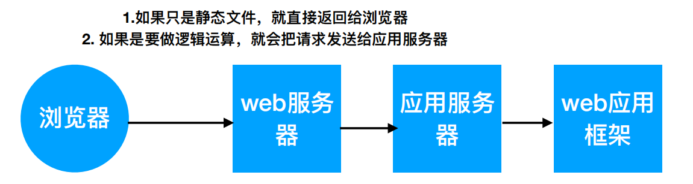

# 1. Web基础相关

### [ToCatalog](./)

## 认识url：

1. 如果使用的是http协议，那么浏览器就会使用80端口去请求这个服务器的资源。
2. 如果使用的是https协议，那么浏览器会使用443端口去请求这个服务器的资源。

   [https://www.baidu.com/](https://www.baidu.com/)

   [https://www.baidu.com/s?ie=utf-8&f=8](https://www.baidu.com/s?ie=utf-8&f=8)

[http://baike.baidu.com/link?url=ELcglgxAgFQ9WlMytXEhxu-WBtI7mTlDj3TJ-Ht6ZSecAYt0hgqY0euqaB60opaEEZ7JChin5vUd\_YkOgMi7BT5kc3E85ZXeoVL2iVfKZu\_jHMcNabK8NXilqnfJknKs](http://baike.baidu.com/link?url=ELcglgxAgFQ9WlMytXEhxu-WBtI7mTlDj3TJ-Ht6ZSecAYt0hgqY0euqaB60opaEEZ7JChin5vUd_YkOgMi7BT5kc3E85ZXeoVL2iVfKZu_jHMcNabK8NXilqnfJknKs)

[http://baike.baidu.com/link?url=ELcglgxAgFQ9WlMytXEhxu-WBtI7mTlDj3TJ-Ht6ZSecAYt0hgqY0euqaB60opaEEZ7JChin5vUd\_YkOgMi7BT5kc3E85ZXeoVL2iVfKZu\_jHMcNabK8NXilqnfJknKs\#5](http://baike.baidu.com/link?url=ELcglgxAgFQ9WlMytXEhxu-WBtI7mTlDj3TJ-Ht6ZSecAYt0hgqY0euqaB60opaEEZ7JChin5vUd_YkOgMi7BT5kc3E85ZXeoVL2iVfKZu_jHMcNabK8NXilqnfJknKs#5)

## URL详解

URL是Uniform Resource Locator的简写，统一资源定位符。

一个URL由以下几部分组成

```text
 scheme://host:port/path/?query-string=xxx\#anchor
```

* scheme：代表的是访问的协议，一般为http或者https以及ftp等。 
* host：主机名，域名，比如www.baidu.com。 
* port：端口号。当你访问一个网站的时候，浏览器默认使用80端口。 
* path：查找路径。比如：www.jianshu.com/trending/now，后面的trending/now就是path。 
* query-string：查询字符串，比如：www.baidu.com/s?wd=python，后面的wd=python就是查询字符串。 
* anchor：锚点，后台一般不用管，前端用来做页面定位的。

一个URL由以下几部分组成：

scheme://host:port/path/?query-string=xxx\#anchor

## web服务器和应用服务器以及web应用框架：

1. web服务器：负责处理http请求，响应静态文件，常见的有Apache，Nginx以及微软的IIS. 
2. 应用服务器：负责处理逻辑的服务器。比如php、python的代码，是不能直接通过nginx这种web服务器来处理的，只能通过应用服务器来处理，常见的应用服务器有uwsgi、tomcat等。 
3. web应用框架：一般使用某种语言，封装了常用的web功能的框架就是web应用框架，flask、Django以及Java中的SSH\(Structs2+Spring3+Hibernate3\)框架都是web应用框架。



